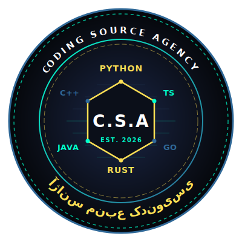

  

# پروژ آژانس منبع کدنویسی (C.S.A)
#### سلام به همه کسانی که دارن این مطلب رو مطالعه میکنن 
کتابی که امروز قرار مطالعه کنید یک کتاب تعاملی و جدید هست که مباحث پایتون رو قدم به قدم برای شما اموزش می‌دهد 
ما بعد از مطالعه های کتاب های فراوان و تحلیل کیفیت آموزش آنها دریافتیم که اکثر خوانندگان فقط درگیر کلمات و مباحث تئوری و اضافه هستن که اکثر بچه ها همان ابتدا از یادگیری منصرف می‌شوند

به همین دلیل ما با هم همکاری کردیم و شروع به نوشتن کتابی جدید و متمایز برای یادگیری پایتون کردیم
​
## ​📊 ویژگی های کتاب
1. زبان: پایتون نسخه ۳.۱۰ به بالا
2. پشتیبانی: دارای کانال پشتیبانی و اموزش
3. کتاب کاملا تعاملی و بر اساس پروژه ها و تجربه شما پیش می‌رود

 ## توجه!
 این نسخه دمو و اولیه کتاب هست که انشالله در چند هفته بعد نسخه کامل آن منتشر خواهند شد

 # دانلود 
 
کافی است از لیست فایل‌های بالا، روی فایل **`[localhost_8080PDF_260707_234234.PDF].pdf`** کلیک کنی و در صفحه باز شده، دکمه **Download** (یا علامت دانلود بالا سمت راست) را بزنی.

## 🛰️ به آژانس بپیوندید 
برای رفع اشکال کدهایتان، دسترسی به چالش‌های هفتگی و ارتباط مستقیم با من، حتماً وارد کانال و گروه VIP ما در تلگرام شوید:

## 🛰️ به آژانس بپیوندید (اتاق جنگ کارآگاهان)
برای رفع اشکال کدهایتان، دسترسی به چالش‌های هفتگی و ارتباط مستقیم با من، حتماً وارد کانال و گروه VIP ما در تلگرام شوید:

🔗 **[ورود به کانال تلگرام آژانس](https://t.me/COOING_SOURCE_AGENCY)**
